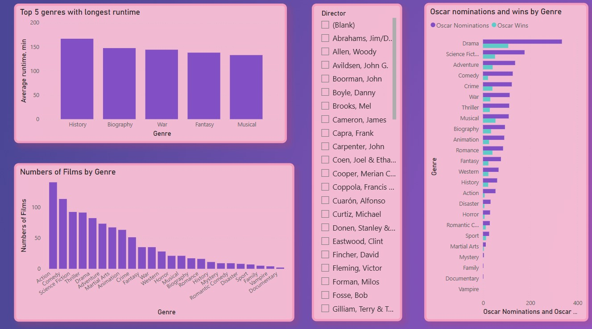
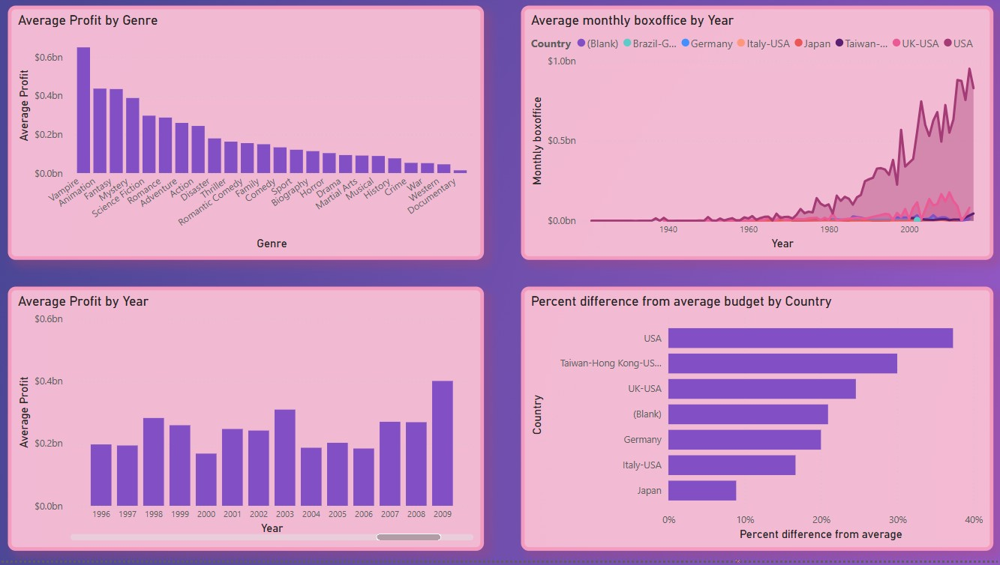

# Films
This project was made to fulfil tasks in Films.docx file. This Power BI report analyses a dataset of films from around the world, providing insights into box office revenue, budgets, profits, and trends over time. The dataset includes fields such as film title, release year, genre, country, budget, box office earnings, and director information.
________________________________________
Data Sources

•	Filmai – Main table with film-level data: title, year, budget, box office, genre, country, director ID

•	GreatestFilms – List of top-rated films with director names

•	A manually created date/year field is used for time-based analysis
________________________________________
Key Metrics & Calculations

1.	Genres and Oscars:

•	Top Genres by Average Duration

•	Films number for each genre

•	Genres by Oscar nominations and wins

•	Top Directors - Slicer for top Directors filtering

2.	Boxoffice and Profit

•	Profit = BoxOffice - Budget

•	Average Profit by year and genre

2.1.	Country Comparison

•	Monthly Revenue Estimates based on Box Office and release year

•	% of Films Above Country’s Average Budget
Average budget and percentage of above-average films per country
(Countries with >30% above average are color-highlighted)

•	Rounded and formatted values for improved readability
## 📊 Dashboard Overview

### Genres and Oscars

### Boxoffice and Profit

